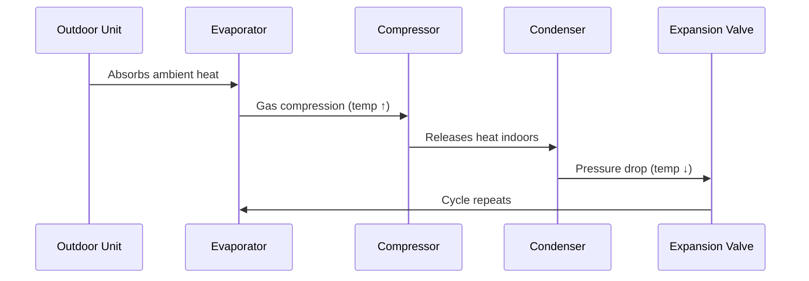
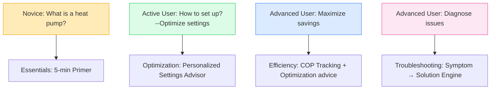

# Project Overview
## Goal
Help UK residents improve the efficiency of their heat pump usage.

## Research Topics of Week 01
### 1. How Heat Pumps Work
- Principles of operation
- System components
- Factors affecting efficiency

#### 1.1 What Exactly Is a Heat Pump?
- <b>Not a heater but a "heat mover": Transfers free thermal energy from air/ground into your home</b>
- run on electricity
- three to four times more efficient than other heating systems, including other electric heating systems--storage heaters, electric radiators and electric boilers

#### 1.2 How Heat Pump Work: The Physics

##### Key Components
| Component        | Function                             | Homeowner Focus                                   |
|------------------|--------------------------------------|---------------------------------------------------|
| Evaporator       | Extracts heat from outdoor air       | Keep clear of debris/snow                         |
| Compressor       | Increases refrigerant pressure/temp  | Main electricity consumer (70% of usage)          |
| Condenser        | Transfers heat to home               | Set water temp ≤50°C for efficiency               |
| Expansion Valve  | Regulates refrigerant flow           | Professional maintenance required                 |

#### 1.3 Efficiency Metrics: Understanding COP
<b>COP: Coefficient of Performance</b>
- COP Formula: Heat Output (kWh) / Electricity Input (kWh)
- Practical meaning: How many heat units you get per electricity unit
- Efficiency Boosters: 
1. ↓1°C water temp → ↑2-3% COP (More precise, math-proven references may be needed) 
2. Continuous operation > start-stop cycling (15-20% more efficient) 
3. Keeping filters clean helps maintain peak system performance 

#### 1.4 UK-Specific Heat Pump Types
resources from: https://www.getaheatpump.org.uk/types-of-heat-pumps#air-source-heat-pump 
| Type | Components | Placement and size | Cost (approx.) |
|-|-|-|-|
| Air source heat pump | Outdoor unit, heat exchanger, hot water cylinder/heat battery | Outdoor unit ~1–1.5 m high, 0.5–1 m wide/deep; indoor unit ~1.5–2 m tall; ≥1 m from property boundary | £9,500–£15,000 (before £7,500 grant) |
| Ground source heat pump (borehole) | Borehole pipework, heat exchanger, hot water cylinder/heat battery | Multi boreholes (~20 cm wide, 75–200 m deep), indoor exchanger and cylinder similar size to ASHP units | ~£21,000 average |
| Ground source heat pump (ground loop) | Buried pipework, heat exchanger, hot water cylinder/heat battery | Trench 1–1.5 m deep, 100–200 m long; ~600 m² land needed; indoor unit similar to ASHP zone equipment | Slightly less than borehole; shared infrastructure reduces cost |
| Air-to-air heat pump | Outdoor heat exchanger, indoor unit (fan-based, wall/floor/duct) | Outdoor ~1–1.5 m; indoor mounted on wall/floor/ceiling or via ducts; no hot water cylinder | £2,400–£8,800; not eligible for grants |
| Shared ground source heat pump | Communal ground loop, individual domestic heat pump unit and hot water cylinder in each home | Ground loop buried in communal space (road/green areas); indoor cylinder ~1.5–2 m, domestic unit similar to other GSHP | Cost per household typically lower due to shared infrastructure |

#### 1.5 UK Climate Adaptation
resources from: 
Energy Saving Trust (2025): Heat Pump Performance Field Study 
Carbon Trust (2024): Heat Pump Optimization Guide 
IEA HPT Annex 58: Cold Climate Heat Pump Systems 
Heat Geek (2025): UK User Behaviour Analysis 
| Region | Winter Considerations |
|-|-|
| Scotland | Specify cold-climate models (-25°C operation) |
| England | Standard units + antifreeze solution |
| Wales | Focus on humidity control (high moisture may cause ↓COP) |

### 2. What Is a Learning Journey?
- A structured, phased approach to guiding users through knowledge
- Helps personalize learning based on user needs and entry point

### 3. Initial Website Prototype
- Designed and implemented the homepage
- Introduced core visual structure and content layout
- Set up modular sections for future learning content

#### 3.1 Planned Content Structure
##### I. Search Engine
Users can search anything they want to know about heat pumps. 
The search bar includes rotating question prompts, such as: 
Describe your question → e.g. Why is my winter electricity bill so high?
##### II. Quick Help for Common Questions
A list of the top five most frequently searched user questions, each with a "See Details/Start Troubleshooting" button for quick access to full explanations.
##### III. Heat Pump Learning Hub
A card-based display of five modules supporting the Heat Pump Learning Journey,
designed to address the learning needs of three user types: Novice, Active, and Advanced. 
Each module includes a "Learn/Explore More" button.
1. Core Knowledge Base:  Foundational concepts and how heat pumps work
2. Efficiency Optimization Guide:  Strategies for smarter, more efficient heat pump use
3. Daily Operation Handbook:  Practical usage, safety, maintenance etc. tips
4. Self-Diagnosis Center:  Quick guides for troubleshooting common problems
5. UK Resources Hub:  Localized support including subsidies, installers, climate guidance, etc.

### 4. Questions (may have been solved)
#### 4.1 How to distinguish my websites like https://www.getaheatpump.org.uk/

##### 1. Core Functional Distinction
| Dimension | GetAHeatPump.org.uk etc. | HeatPumpGo|
|-|-|-|
| Primary Goal | Drive heat pump installations | Optimize existing heat pump usage--Lifetime cost minimization |
| User Journey Stage | Pre-installation research | Post-installation operation |
| Key Action | Find installers/get quotes | Solve problems/improve efficiency |
| Success Metric | Installation conversions | Energy savings (kWh/£) or £38 saved this month |
| Optimization Goal | Generic tips | Asymptotic cost convergence | 

##### 2. Differentiated User Journey Architecture

##### 3. Efficiency-Centric Design Framework
1. Curated Foundational Knowledge
- Teach only efficiency-impacting concepts
- Omit irrelevant technical details (e.g., refrigerant formulas)
2. Every page displays:
"ROI of this module: Learn X mins → Save £Y lifetime"
Or track electricity fees per month