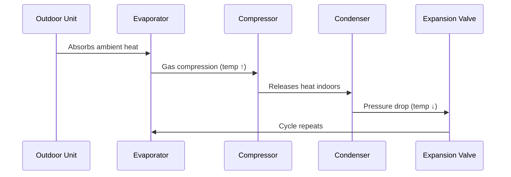
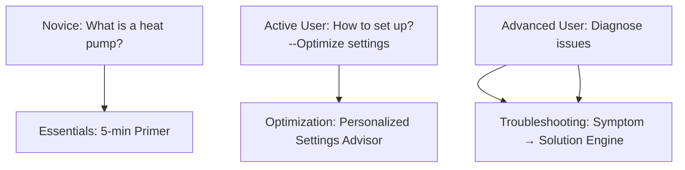

# Project Overview
## Goal
Help UK residents improve the efficiency of their heat pump usage.

## Research Topics of Week 01
### 1. How Heat Pumps Work
- Principles of operation
- System components
- Factors affecting efficiency

#### 1.1 What Exactly Is a Heat Pump?
- <b>Not a heater but a "heat mover": Transfers free thermal energy from air/ground into your home</b>
- run on electricity
- three to four times more efficient than other heating systems, including other electric heating systems--storage heaters, electric radiators and electric boilers

#### 1.2 How Heat Pump Work: The Physics

##### Key Components
| Component        | Function                             | Homeowner Focus                                   |
|------------------|--------------------------------------|---------------------------------------------------|
| Evaporator       | Extracts heat from outdoor air       | Keep clear of debris/snow                         |
| Compressor       | Increases refrigerant pressure/temp  | Main electricity consumer (70% of usage)          |
| Condenser        | Transfers heat to home               | Set water temp ≤50°C for efficiency               |
| Expansion Valve  | Regulates refrigerant flow           | Professional maintenance required                 |

#### 1.3 Efficiency Metrics: Understanding COP

### 2. What Is a Learning Journey?
- A structured, phased approach to guiding users through knowledge
- Helps personalize learning based on user needs and entry point

### 3. Initial Website Prototype
- Designed and implemented the homepage
- Introduced core visual structure and content layout
- Set up modular sections for future learning content

#### 3.1 Planned Content Structure
1. Core Knowledge Base:  Foundational concepts and how heat pumps work
2. Efficiency Optimization Guide:  Strategies for smarter, more efficient heat pump use
3. Daily Operation Handbook:  Practical usage, safety, maintenance etc. tips
4. Self-Diagnosis Center:  Quick guides for troubleshooting common problems
5. UK Resources Hub:  Localized support including subsidies, installers, climate guidance, etc.

### 4. Questions (may have been solved)
#### 4.1 How to distinguish my websites like https://www.getaheatpump.org.uk/

##### 1. Core Functional Distinction
| Dimension | GetAHeatPump.org.uk etc. | HeatPumpGo|
|-|-|-|
| Primary Goal | Drive heat pump installations | Optimize existing heat pump usage--Lifetime cost minimization |
| User Journey Stage | Pre-installation research | Post-installation operation |
| Key Action | Find installers/get quotes | Solve problems/improve efficiency |
| Success Metric | Installation conversions | Energy savings (kWh/£) |

##### 2. Differentiated User Journey Architecture
