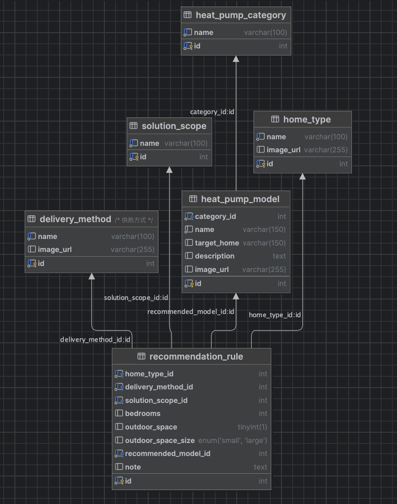

# Questions from Last Week (Still Unresolved)
1. **Should each page provide direct user feedback such as:**
Estimated ROI (time spent vs. lifetime savings)? Learn X mins → Save £Y lifetime
Real-time or monthly electricity cost tracking?
Progress indication within the heat pump learning journey (e.g., Novice → Advanced)?
**Follow-up Considerations:**
**Feasibility:** Electricity tracking may require smart meter integration or user-provided utility data.
**Motivational value:** ROI-style feedback and learning progress gamification can help improve user retention and encourage deeper engagement.
**Privacy:** Since the website does not collect user data, feedback must be generated without storing personal information — possibly using local/session storage.

2. **Should we personalize learning paths beyond home type?**
e.g., based on user goals: cost savings / sustainability / comfort?
Could a short optional quiz classify users into different learning personas?

3. **Which pages require internationalization or localization support?**
Should we prepare for multi-language support at this stage?
What terms (e.g., “Flat” vs. “Apartment”) vary across UK audiences?

4. **Do we need a dedicated accessibility review (a11y)?**
Check ARIA labels, keyboard navigation, color contrast, etc.
Especially important for diagram-heavy, interactive content.
Next Steps (To do this week)

# Next Steps (To do this week)
1. Design 4 distinct UI prototypes for the learning journey
2. Finish database structure and connect it with Spring Boot backend

# Design 4 distinct UI prototypes
[View 4 Prototypes on Figma](https://www.figma.com/design/FYXBRrEyK2Uux0yu9Oj5cN/Heatpump-01?node-id=46-331&t=7TpZ9SOAYtvYOPCr-1)

**goal:** 
To build an **interactive, visual-first website** that helps users with different levels of understanding learn about heat pumps and improve the efficiency of their home usage. The site follows a **"learning journey"** concept, guiding users through personalized paths to quickly access relevant knowledge.

## 1. Spiral Learning Journey Map UI Design Concept
- Displays a floating spiral path with distributed knowledge blocks (nodes) along the journey. Spiral and nodes can include soft shadows or float-style animation (via Smart Animate).
- Users can scroll or drag along the path; clicking a node opens detailed content.
- Inspiration: Museum-style learning maps + Doodle Jump-like visual mood.

### 1.1 Core Layout and Navigation
1. **Spiral Structure:**
Knowledge points are distributed along a spiral path, representing different learning stages.
2. **Color Legend:**
A sidebar legend explains the user category of each node:</br>
🟡 Beginner
🔵 Heat Pump User
🔴 Troubleshooting
⚫ Government Support

### 1.2 Node Interactions
1. **Hover Effect:**<br>
When the user hovers over a knowledge node:
- The node becomes brighter and enlarged.
- It signals that the node is interactive.
2. **Click Action:**<br>
Each knowledge node supports two types of behavior: 
- Display Overlay – A floating card shows detailed knowledge content.
- Navigate to Frame – Jumps to a separate knowledge detail page.

### 1.3 Search + Auto Focus
**Search Bar:**
- Users can enter a question or keyword (e.g., Why is my electricity bill high?)
- The spiral zooms in and centers on the relevant knowledge node.

### 1.4 View Mode Switch: Bird View ↔ Step View
1. **Bird View (default):**
- Top-down overview of the spiral and all topics.
2. **Step View:**
- Switches to a first-person perspective.
- The camera follows the spiral path, one node at a time.
- Ideal for immersive storytelling and focused learning.

### 1.5 Progress Tracking
- **Viewed Topic Indicator:** <br>
After a user views a topic, nodes can change color (e.g., dim or glow).
- **Progress Summary:**<br>
Displayed below the spiral: ```Progress: 6/12 topics viewed (50%)```<br>
Encourages full completion of the learning journey.

## 2. Quiz-based Interactive UI Design Concept
- A 3D interactive model of a heat pump (and optionally, house cross-section).
- User can zoom in/out, rotate, and click on components to learn their function.
- Visual interaction inspired by Apple product pages, possibly WebGL or lightweight AR.
- References: [NY Clean Heat Planner](https://cleanheat.ny.gov/planner/quiz/?show-all=true) a great example of step-by-step guidance and heat pump matching.

### 2.1 User Pathways (Homepage Entry)
On the homepage, users are directed to one of three learning journeys through clear buttons:
1. **Pre-Installation Guide**<br>
For users who haven’t installed a heat pump and want to learn about preparation and selection.
2. **Troubleshooting**<br>
For users experiencing issues with their current heat pump.
3. **Efficiency Optimization**<br>
For users who already use heat pumps and want to improve performance.
Each button takes the user to a separate interactive page.

### 2.2 Interactive Map in Pre-Installation Path
- A 3D community map inspired by the city of Bristol is placed at the center of the page.
- Iconic buildings and streets guide users to click on different home types (Detached, Terraced, etc.).
- This creates a sense of neighborhood exploration and helps users visually select their home type.

### 2.3 Home Type Page (e.g., Detached)
- A 3D model of the house is shown, with interactive outdoor features like garden and driveway.
- The page opens with a guiding message:<br>
“Help us recommend a suitable heat pump for your home.”
- Users answer a few quick questions:<br>
How many bedrooms does your home have?<br>
Do you have a private outdoor space?<br>
What is your current heating system?<br>
- As the user answers, the 3D model updates in real-time (e.g., adding more rooms or a garden).
- Zoom and focus tools let users "enter" the house to explore details.
Users can:<br>
```
1. Click on windows to learn about insulation advice.
2. Click on walls for renovation suggestions.
3. Click on the heat pump to learn about core parts and how it works.
```
Each click provides a deeper layer of understanding, similar to exploring a game world.

### 2.4 Recommendation Results Page
After clicking “Show My Recommendation,” users are directed to a results page that:
- Presents the recommended heat pump type (air source, ground source, hybrid).
- Displays images and text describing the suggested solution.
- Explains why this solution fits the user’s situation (e.g., “Your home has a garden and 3 bedrooms...”).
- Provides a button to explore more about the specific pump type.

### 2.5 Navigation and Page Structure
- All pages include a breadcrumb trail, for example:<br>
```Home > Pre-Installation > Choose the Type of Your Home > Detached```<br>
This helps users know where they are and navigate back easily.
- Some pages reuse the same layout and logic, only changing content based on the user’s path.

### 2.6 Technical and Interaction Tips
- Visual hints such as “Try to zoom in/out” help guide the user.
- Smooth scroll and layered page design ensure a fluid experience.
- All animations and feedback use soft transitions for a pleasant interaction.

## 3. Doodle Jump UI Design Concept
- A gamified step-by-step quiz system where users explore topics through micro challenges and instant feedback.
- Suitable for guiding users through decision logic (e.g., which heat pump suits you).
### 3.1 Path Selection (Starting the Journey)
- The user sees three starting points on the screen (e.g., `Beginner`, `Intermediate`, `Problem Solving`).
- After selecting one:
  - The corresponding path and all its linked knowledge nodes are highlighted.
  - All other paths fade out or reduce opacity to reduce distraction.
  - The user can scroll vertically to view the full path and nodes.

### 3.2 Node Interaction
- Users navigate the spiral path by:
  - Scrolling vertically;
  - Or using keyboard keys: `↑ ↓` to control character jumps.
- When the user’s avatar lands on a knowledge node:
  - The node brightens and enlarges;
  - A floating info card overlay appears with brief knowledge content:

    ```
    ┌────────────────────┐
    │ Why Heat Pump?     │
    │ - Brief summary    │
    │ [Read More]        │
    └────────────────────┘
    ```

- Clicking a node performs either:
  - Open Overlay (showing full knowledge card);
  - Or Navigate to Frame (to a new detail page).

### 3.3 Movement Mechanics

- Keyboard controls:
  - `←` and `→`: Move the avatar left/right;
  - `↑` or `Space`: Jump to platforms (nodes).
- The avatar:
  - Snaps to the closest valid platform;
  - Or jumps directly to a node when it's clicked.
- The currently active node is visually marked (e.g., glow or pulse effect).

### 3.4 Visual & Interactive Features

| Feature                  | Description                                                   |
|--------------------------|---------------------------------------------------------------|
| Node States              | Default, Hovered, Completed (✔), Recommended (★), Current     |
| Visual Path Variations   | Vertical depth or parallax layers for visual clarity          |
| Zoom Support             | Scroll or pinch to zoom in/out of the knowledge map           |
| Read Progress Tracking   | Completed nodes marked with checkmarks                        |
| Branching Paths          | Use curves, arrows, or gradients to show learning flow        |
| Hover Cards              | Info card appears on hover or jump landing                    |

### 3.5 Optional Add-ons

- Mini Map on top-right corner for full route overview and quick jump.
- Filter toggle: Show only unread / starred / all topics.
- Search bar: Jump directly to a node by keyword.
- Micro-achievement system: After completing sections, popups reward progress.

### 3.6 Final User Experience Goal
Learners can explore freely, jump through stages, and interact with knowledge nodes like playing a platformer game — making the learning process engaging and personalized.

## 4. Knowledge Bubbles UI Design Concept

### 4.1 Core Concept
- The page features floating circular “knowledge bubbles,” each representing a knowledge point.
- All bubbles start at the same size. Each time a user clicks, searches, or visits a topic, the corresponding bubble grows larger.
- Combines the visual language of a word cloud and interactive learning path.

### 4.2 Page Structure
1. **Background & Layout**
   - Use a neutral gradient background to make colorful bubbles stand out.
   - Randomly distribute bubbles across the canvas (use Auto Layout with Wrap to simulate bubble dispersion).
   - Support vertical or free scrolling for exploring more bubbles (horizontal + vertical scrollable canvas).
2. **Knowledge Bubble (Each Knowledge Node)**<br>

| Property | Description |
| - | - |
| **Label** | Title of the knowledge topic |
| **Size**  | Default 48px; grows to 64px after visit; up to 96px after repeated interaction |
| **Color** | Highlighted colors for recommended topics; default colors (blue/purple) for others |
| **Border** | Read bubbles can be outlined or have reduced opacity |
| **Hover/Click** | Show tooltip with title + summary + "Read More" action |

3. **Top Bar: Search + Filters**
- Keyword search bar allows users to highlight or filter bubbles.
- Optional filter tags:
  - `All` / `Unread` / `Favorite`

### 4.3 Interaction Logic
1. **Initial State**
   - All bubbles are equally sized and randomly positioned.
   - Hovering reveals a tooltip/preview card.
   - Clicking opens a detailed page or floating content panel.
   - Bubble status is recorded as “read”; it grows in size and becomes more visually emphasized (color or border).

2. **Search Interaction**
   - When users enter a keyword:
   - Matching bubbles grow or highlight.
      - Non-matc hing bubbles fade out (lower opacity).

3. **Behavior Feedback**
   - Each click is logged using `localStorage` to simulate a persistent learning journey.
   - Users see visual feedback of progress without needing to sign in.
   - Bubble size reflects learning interest and engagement.

### 4.4 Visual Inspirations

| Source | Feature |
|--------|---------|
| Google Trends / Word Cloud | Bubble size reflects interaction frequency |
| Genially / Miro | Floating, interactive learning flow |
| Bubble Charts | Data-driven expression of user behavior & knowledge |

### 4.5 Additional Features
- **Mini Map Navigation**: If the canvas contains many bubbles, add a minimap in the bottom-right corner.
- **Animated Appearance**: On page load, bubbles can gently pulse and float using Smart Animate to simulate a fluid environment.
- **Learning Level Views**:
  - `Novice View`: Shows only beginner topics.
  - `Advanced View`: Reveals the full set of topics.

<br>

# Database structure and Backend Development
See project **heatpump-backend** in VS Code for full implementation details.
Database tables are designed and managed in DataGrip, under the schema **heatpump**.
Below is the ER diagram for the `heatpump` database schema:

